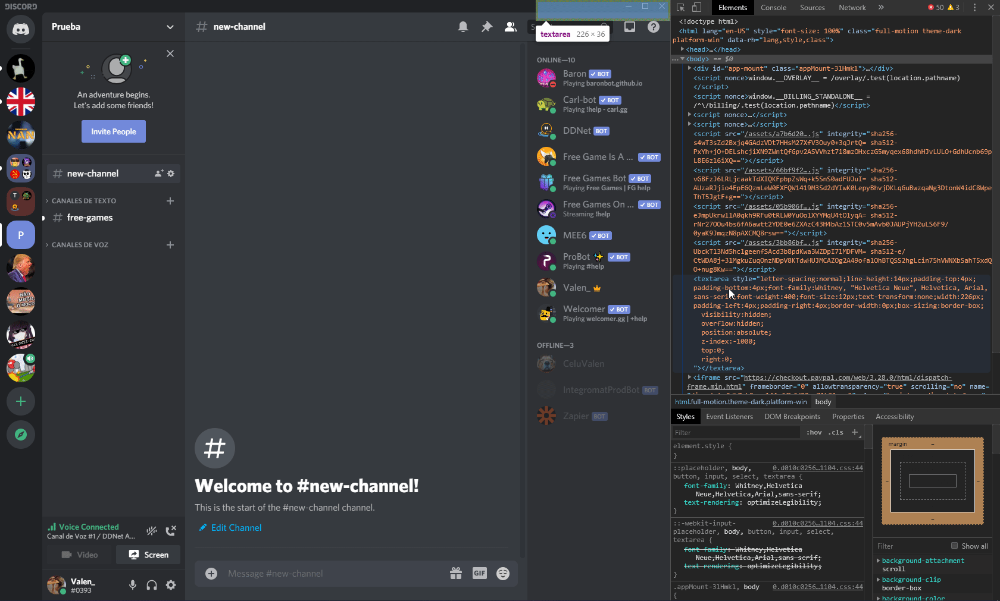

# DISCORD EMOTE STEALER

Steal custom emotes from other servers.

## Requirements
Requests library is necessary.

```bash
pip install requests
```

## Usage
Open inspect element in Discord (Ctrl + Shift + I) and copy the html code of the emote section. Paste it in a .txt file called html in the same folder as the script.


